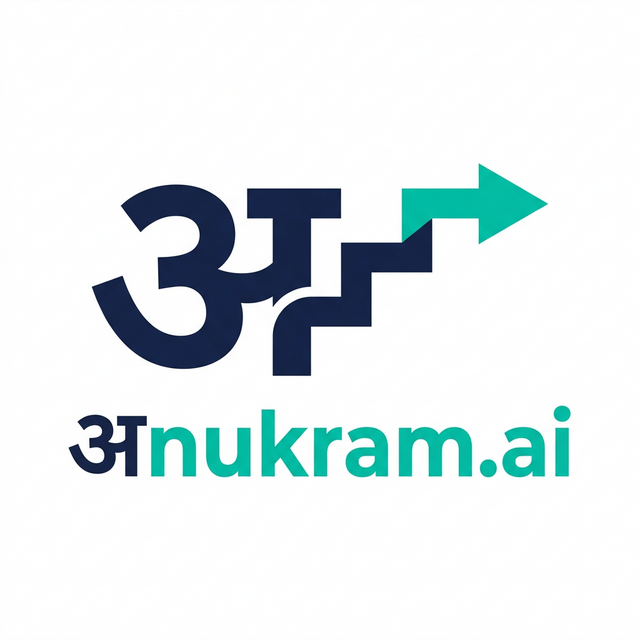

<div align="center">

  
  
  <p>
    <b>Architect Your Future with AI-Powered Personalized Learning</b>
  </p>

  <p>
    <a href="https://ai-vidya-990444310222.asia-south1.run.app/">🚀 <b>View Live Demo</b></a>
  </p>

  <!-- Badges -->
  <p>
    
    
    
    
    
    
  </p>

  <br />
</div>

---

## 📖 Overview

**अnukram.ai** is a next-generation education platform that solves the "tutorial hell" problem. Instead of endless searching, it uses **Google's Gemini 1.5 Flash** to act as your personal academic advisor.

Simply tell it what you want to learn (e.g., *"Full Stack Development in 3 months"*), and अnukram.ai generates a **structured, day-by-day curriculum** tailored to your timeline. It doesn't just list topics; it provides resources, tracks your progress, and even quizzes you.

Now deployed on **Google Cloud Run** for distinct scalability and performance.

---

## ✨ Key Features

### 🎓 **AI Curriculum Generator**
- **Instant Roadmaps**: Generates full syllabuses for ANY topic in under 30 seconds.
- **Custom Timelines**: Adapts the workload based on whether you have 2 weeks or 6 months.
- **Dynamic Content**: Uses latest AI to ensure learning paths are modern and relevant.

### 🤖 **AI Tutor & RAG (Retrieval Augmented Generation)**
- **YouTube Intelligence**: Paste a YouTube video link, and our RAG engine creates a knowledgeable chatbot specifically for that video.
- **Ask Questions**: Chat with your learning materials to clarify doubts instantly.

### 📊 **Gamified Dashboard**
- **Progress Tracking**: Visual progress bars for every course.
- **Streak System**: keeps you motivated to learn every day.
- **XP & Levels**: Earn experience points as you complete lessons.

### 🧩 **Interactive Quizzes**
- **Self-Assessment**: AI generates quizzes based on your specific curriculum to test retention.

---

## 🛠️ Technology Stack

| Component | Technology | Description |
| :--- | :--- | :--- |
| **Backend API** | **FastAPI** | High-performance, async Python framework. |
| **AI Engine** | **Google Gemini 1.5** | SOTA LLM for curriculum & quiz generation. |
| **Database** | **Firebase Firestore** | Real-time NoSQL database for user state & sync. |
| **Vector DB** | **ChromaDB** | Stores embeddings for the RAG/Chat-with-Video feature. |
| **Deployment** | **Google Cloud Run** | Serverless containerized deployment. |
| **Frontend** | **Vanilla JS / CSS** | Lightweight, high-performance UI with no framework overhead. |
| **DevOps** | **Docker** | Fully containerized application. |

---

## 🚀 Getting Started

### Prerequisites
- Python 3.10+
- Google Cloud Project (Vertex AI API enabled)
- Firebase Project (Service Account)

### Installation (Local)

1.  **Clone the Repo**
    ```bash
    git clone https://github.com/ayush6645/AI-vidya.git
    cd AI-vidya
    ```

2.  **Install Dependencies**
    ```bash
    pip install -r requirements.txt
    ```

3.  **Environment Setup**
    Create a `.env` file or export variables:
    ```bash
    export GOOGLE_API_KEY="your_gemini_key"
    export FLASK_SECRET_KEY="your_secret_key"
    # Ensure serviceAccountKey.json is in the root for Firebase
    ```

4.  **Run with Uvicorn**
    ```bash
    uvicorn backend.app.main:app --reload
    ```
    Visit `http://localhost:8000`

### 🐳 Installation (Docker)

1.  **Build Image**
    ```bash
    docker build -t ai-vidya .
    ```

2.  **Run Container**
    ```bash
    docker run -p 8080:8080 -e PORT=8080 --env-file .env ai-vidya
    ```

---

## 📂 Project Structure

```
अnukram.ai/
├── backend/            # FastAPI Application
│   ├── app/
│   │   ├── api/        # REST API Routes
│   │   ├── core/       # Config & Security
│   │   ├── services/   # AI, DB, & RAG Logic
│   │   └── prompts/    # LLM Prompt Templates
├── Web_App/            # Frontend Assets (HTML/CSS/JS)
├── Dockerfile          # Container Config
├── requirements.txt    # Python Dependencies
└── startup.sh          # Production Entrypoint
```

---

## 🤝 Contributing

Contributions are welcome! Please feel free to submit a Pull Request.

1.  Fork the Project
2.  Create your Feature Branch (`git checkout -b feature/NewFeature`)
3.  Commit your Changes (`git commit -m 'Add NewFeature'`)
4.  Push to the Branch (`git push origin feature/NewFeature`)
5.  Open a Pull Request

---

<div align="center">
  <p>Made with ❤️ by <b>Gyan Gupta</b></p>
  <p>
    <a href="https://www.linkedin.com/in/gyan-gupta-b2832a347/">LinkedIn</a> • 
    <a href="https://github.com/ayush6645">GitHub</a>
  </p>
</div>
